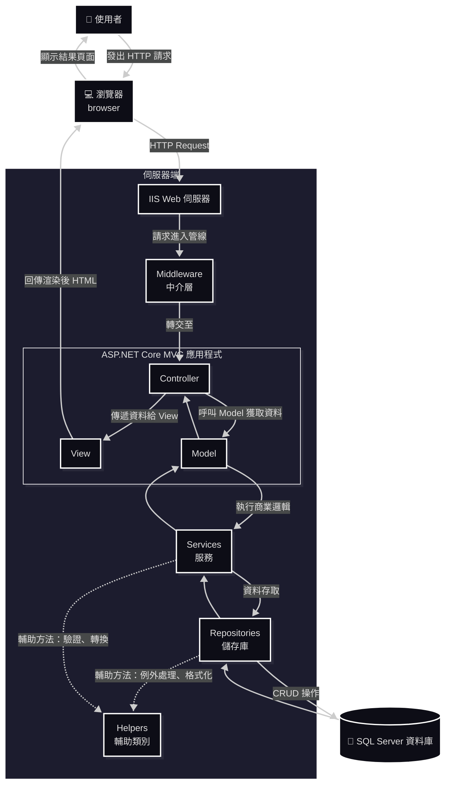
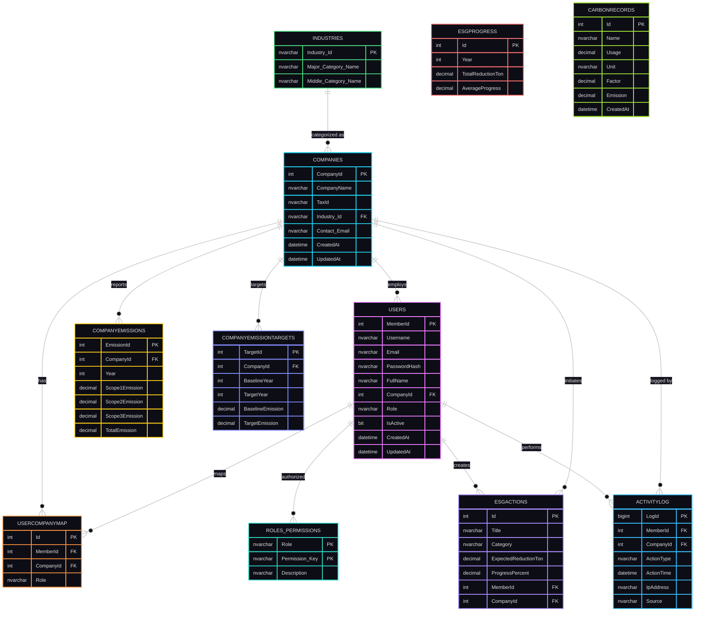

  

  
# 🌿 CarbonProject — ESG 碳足跡管理系統

> 以 ASP.NET Core MVC 架構開發的 ESG 碳足跡管理平台，協助企業追蹤、分析與報告碳排放數據，實現永續發展與 ESG 目標。

---

## 🧭 專案資訊 (Project Information)
| 分類 | 說明 |
|------|------|
| **專案名稱** | CarbonProject |
| **開發框架** | ASP.NET Core MVC |
| **資料庫** | SQL Server / Azure SQL |
| **主要功能** | 帳戶管理、碳排追蹤、目標設定、活動紀錄 |
| **開發者** | 徐秉群 (Allen Hsu) |
| **版本** | v1.0.0 |

---

## 📚 目錄 (Table of Contents)
- [專案簡介](#專案簡介)
- [專案目標](#專案目標)
- [系統架構](#系統架構)
- [核心模組](#核心模組)
- [系統安全設計](#系統安全設計)
- [資料庫設計（SQL Server）](#資料庫設計sql-server)
- [專案亮點](#專案亮點)
- [後續發展建議](#後續發展建議)
- [License](#License)
- [報告與文件](#報告與文件)
- [聯絡資訊](#聯絡資訊)

---

## 📖 專案簡介

**CarbonProject** 是一款面向企業的碳排放與 ESG 管理系統。系統以可擴充的多層式架構設計（Controller / Service / Repository / Model），強調安全性與可維護性。  
它能協助企業：  
- 🔍 **盤查碳足跡**：自動計算與匯總碳排放數據  
- 📊 **視覺化分析**：呈現碳排放趨勢與熱點  
- 📑 **生成 ESG 報告**：ESG 行動管理與報表匯出（含 PDF）。 
- 👥 **追蹤行動方案**：監控 ESG 進度與目標達成率  

本系統以 **ASP.NET Core MVC 8.0** 為核心，整合 **SQL Server、iTextSharp PDF、Chart.js** 等技術，  
並特別強調 **使用者體驗 (UX)** 與 **資安防護 (Security)**。

---

## 🧭 專案目標

- 🧩 建立完整的 **碳排放與 ESG 管理解決方案**
- 🎯 提供簡潔直觀的 **使用者介面**
- 🛡️ 強化 **企業資料安全、資料稽核與可追溯的活動紀錄**
- 🌱 協助企業達成 **碳排放量降低 30%**
- ‍🔧 支援雲端部署與擴展（IIS / Azure）

---

## 🏗️ 系統架構

**技術堆疊（Tech Stack）**
| 類別 | 技術 |
|------|------|
| Framework | ASP.NET Core MVC 8.0 |
| 語言 Language | C# |
| 資料庫 Database | SQL Server / Azure SQL |
| ORM | Entity Framework Core |
| PDF Engine | iTextSharp |
| 前端 | Razor Views, Bootstrap, Chart.js |
| 驗證服務 Authentication | Claims-Based + Session + JWT |
| Logging | ActivityLog 模組 |
| 部署 | IIS / Azure Web App |

**系統流程（簡要示意）**

---

## 💡 核心模組  

| 模組 | 功能描述 |
|------|-----------|
| 會員登入 / 註冊 | 支援公司與成員帳號，採 Session 驗證 |
| 碳排放紀錄 | 可記錄年度排放量與目標值 |
| 視覺化圖表 | 使用 Chart.js 呈現排放趨勢與比例 |
| 活動紀錄 | 追蹤登入、更新與資料變更 |
| 管理者後台 | 查看全公司資料與平均排放狀況 |

- **會員與權限管理**（Admin / Company / Staff / Viewer）  
- **碳排放記錄與目標**（CompanyEmissions、CompanyEmissionTargets）  
- **ESG 行動管理**（ESGActions、ESGProgress）  
- **活動日誌**（ActivityLog）：操作稽核、IP / User-Agent / CorrelationId  
- **公告系統**（Company 層級）  
- **報表匯出**：PDF（iTextSharp）、Chart.js 視覺化  
---

## 🔐 系統安全設計
- Claims-based 認證 + Session + JWT（可選「記住我」功能）  
- 密碼使用 BCrypt 加密（BCrypt.Net-Next）  
- 帳號鎖定機制：連續失敗 5 次鎖定，30 分鐘自動解鎖  
- CSRF 防護（ValidateAntiForgeryToken）與安全 Cookie（HttpOnly / Secure / SameSite）  
- 角色/權限表（Roles_Permissions）實作 RBAC  

---

## 📀 資料庫設計（SQL Server）  
簡化 ER 圖（主要表格與關聯）：  

---

## 🌟 專案亮點

  本專案採用 **ASP.NET Core MVC 架構**與**多層式設計**原則，結合現代化的技術實踐，打造出高效能、可維護、可擴充的企業級碳管理系統。  
  The project is built with ASP.NET Core MVC architecture and modern design principles, focusing on performance, scalability, and maintainability for enterprise-level carbon management.  
- 採用 多層式架構（Controller / Service / Repository）提高可維護性  
- 使用 EF Core 簡化 ORM 與 Migration 管理  
- ActivityLog 提供完整操作稽核與追蹤能力  
- 支援 PDF 匯出（中文字體處理）與 Chart.js 視覺化報表  
- 設計兼顧安全性（BCrypt、CSRF、HttpOnly Cookie、帳號鎖定）  

### 🧩 架構設計 Architecture Design

- **ASP.NET Core MVC Framework**  
  採用跨平台、高效能的 ASP.NET Core，具備良好的可維護性與可擴展性。  
  Built on ASP.NET Core, a high-performance and cross-platform web framework for scalable and maintainable applications.

- **Layered Architecture (多層式架構)**  
  將應用分為 Controller、Service、Repository、Model 等層，確保職責分離。  
  Implements a layered architecture to ensure clear separation of concerns between components.

### 💾 資料存取層 Data Access Layer

- **Entity Framework Core (EF Core)**  
  使用 EF Core 進行 ORM 操作，簡化資料庫 CRUD 流程，並支援 LINQ 查詢與 Migration 管理。  
  Utilizes EF Core for ORM-based data access, simplifying CRUD operations and supporting LINQ and database migrations.

- **Repository Pattern**  
  將資料存取邏輯封裝於 Repository，實現資料層與業務邏輯層分離。  
  Encapsulates data access logic within repositories for better abstraction and maintainability.

### 🧠 系統設計 System Design

- **Dependency Injection (依賴注入)**  
  使用 ASP.NET Core 內建的 DI 容器，降低耦合度並提升可測試性。  
  Employs built-in dependency injection to enhance testability and reduce coupling between components.

- **ViewModel Pattern**  
  將資料由 Controller 傳遞至 View，確保資料結構與顯示邏輯分離。  
  Uses ViewModel to transfer data between Controller and View, improving front-end flexibility.

- **Session 狀態管理 (Session Management)**  
  透過 Session 儲存登入使用者資訊（如 MemberId, CompanyId），維持使用者狀態。  
  Manages user sessions to persist authentication and contextual data between requests.

### 📊 系統紀錄與追蹤 System Logging & Auditing

- **ActivityLog 使用者活動紀錄**  
  將使用者操作記錄於資料表中，包括登入、登出、修改、刪除等動作，方便後續稽核與行為分析。  
  Records all user actions such as login, logout, and updates into the ActivityLog table for audit and analysis.

- **IP & User-Agent 追蹤**  
  每筆活動紀錄包含 IP 位址與使用者代理資訊，以提升安全性與可追溯性。  
  Each activity entry stores IP address and User-Agent for enhanced security and traceability.

### 🔐 安全性設計 Security Features

- **角色與權限管理 (Role-Based Access Control)**  
  使用 Roles_Permissions 表實作角色權限控制，確保不同身分的使用者僅能存取對應功能。  
  Implements RBAC (Role-Based Access Control) using the Roles_Permissions table.

- **帳號安全機制 (Account Protection)**  
  支援電子郵件驗證、登入失敗次數限制與狀態鎖定，保障系統安全。  
  Supports email confirmation, login attempt limits, and account locking for enhanced security.

### 🌱 永續發展模組 Sustainability Modules

- **CompanyEmissions 與 ESGActions 模組整合**  
  支援公司碳排放紀錄、ESG 行動追蹤與減碳成效統計。  
  Integrates company emission data with ESG actions for emission tracking and sustainability analysis.

- **自動計算排放總量 (TotalEmission)**  
  使用 SQL 計算欄位自動匯總 Scope 1, 2, 3 排放量，減少重複計算。  
  Uses computed SQL columns to automatically aggregate Scope 1–3 emission data.

### 🧰 技術總覽 Tech Stack  
| 分類 | 技術 |
|------|-----------|
| 前端 (Frontend) | Razor Views, HTML5, Bootstrap |
| 後端 (Backend) | ASP.NET Core MVC, C# |
| ORM | Entity Framework Core |
| 資料庫 (Database) | Microsoft Azure SQL Server |
| 紀錄與稽核 | ActivityLog Table, Middleware Logging |
| 架構設計 | Repository Pattern, ViewModel, DI |
| 安全性 | Session, Role-Based Access, Validation |

---

## ⌨️ 後續發展建議  
- **加入身份驗證和授權：**  
  目前專案沒有實現完整的身份驗證和授權功能，建議使用 ASP.NET Core Identity 來實現更安全的身份驗證和授權。  
- **使用更現代化的前端框架：**  
  目前專案可能使用 jQuery 或 Bootstrap 等前端框架，建議使用更現代化的前端框架，例如 React、Vue.js 或 Angular，來提高使用者體驗。  
- **使用更強大的日誌框架：**  
  目前專案可能使用 ILogger 介面來記錄日誌，建議使用更強大的日誌框架，例如 Serilog 或 NLog，來提供更豐富的日誌功能。  
- **加入單元測試和整合測試：**  
  目前專案沒有提供測試程式碼，建議加入單元測試和整合測試，以確保程式碼的品質和穩定性。  
- **使用更安全的 Session 管理：**  
  目前專案使用 Session 來管理使用者狀態，建議使用更安全的 Session 管理方式，例如使用 Redis 或 SQL Server 來儲存 Session 資料。  
- **優化資料庫效能：**  
  建議對資料庫進行效能優化，例如建立索引、優化查詢語句等，以提高應用程式的效能。

---

## 📄 授權條款 (License)

此專案僅供學術與內部開發測試用途，未經授權請勿用於商業目的。

Copyright (c) 2025 Allen Hsu

Permission is hereby granted to use, copy, and modify this software 
for **academic, research, or educational purposes only**, provided 
that proper credit is given to the original author.

Commercial use, redistribution, or modification for profit is 
strictly prohibited without explicit written permission.

THE SOFTWARE IS PROVIDED "AS IS", WITHOUT WARRANTY OF ANY KIND.

---

## 📁 報告與文件  
詳細功能說明、資料庫腳本與長篇報告放在  
docs/  
Report/  
database/  

---

## ✉️ 聯絡資訊

開發者：徐秉群 (Allen Hsu)
Email：mituteruhsu@gmail.com

---

# CarbonProject 碳足跡管理系統 - 功能說明報告
  專案文檔資料 / CarbonProject功能說明報告.txt  
  建立日期：2025-10-29
# 

---

#【專案概述】
• 專案名稱：CarbonProject 碳足跡管理系統
• 開發框架：ASP.NET Core MVC 8.0
• 資料庫：SQL Server (Azure SQL Database)
• 技術架構：Claims-based 認證 + Session + JWT 三重支持

## 第一章：角色權限系統
【角色定義】
系統提供四種使用者角色，每種角色擁有不同的功能權限：

• Admin（管理員）
  - 可訪問所有功能
  - 管理員金鑰：QE2U-4HIY-WXZ5-679P
  - 擁有會員管理權限，可編輯、刪除所有會員資料
  - 可訪問活動日誌系統

• Company（企業）
  - 可訪問企業儀錶板
  - 管理自己公司的員工（Company 和 Staff 角色）
  - 可編輯、刪除公司員工資料
  - 可查看 ESG 行動與進度
  - 可發布公告給公司員工

• Staff（企業員工）
  - 註冊時需選擇企業並自動綁定
  - 可訪問系統基本功能
  - 可查看公司公告
  - 可參與 ESG 行動方案

• Viewer（一般使用者）
  - 可訪問系統基本功能
  - 只能查看公開資訊

【核心程式碼位置】
位置：Controllers/Account.cs:107-126
方法：Login() - Claims 身份認證設定
功能：建立 Claims Principal（用戶ID、用戶名、角色、信箱）

位置：Controllers/Account.cs:451-478
方法：Admin_read() - 管理員會員管理
功能：檢查 Admin 角色權限，顯示所有會員列表

位置：Controllers/Account.cs:482-518
方法：CompanyDashboard() - 企業儀錶板
功能：檢查 Company 角色，顯示公司員工列表

## 第二章：使用者認證與註冊系統
【登入功能】
• 支援三種認證機制：Claims-based、Session、JWT（記住我功能）
• 帳號鎖定機制：5 次失敗後鎖定，30 分鐘後自動解鎖
• 登入驗證：帳號至少4位數，密碼至少8位數
• 安全性：CSRF 保護、密碼加密（BCrypt）

核心方法：
位置：Controllers/Account.cs:48-170
方法：Login(string UID, string password, bool RememberMe)
功能：登入驗證、Session 設定、JWT Token 生成、活動日誌記錄

位置：Models/Members.cs
方法：CheckLogin() - 登入驗證
方法：IncrementFailedLogin() - 記錄失敗次數
方法：UpdateLastLoginAt() - 更新最後登入時間

【註冊功能】
• 支援四種角色註冊（需管理員金鑰驗證 Admin 角色）
• 企業註冊：自動建立或綁定現有企業
• 企業員工註冊：需輸入已存在的企業名稱，自動綁定公司
• 輸入驗證：正則表達式驗證帳號、信箱、密碼格式

核心方法：
位置：Controllers/Account.cs:216-402
方法：Register() - 會員註冊處理
功能：驗證管理員金鑰、企業綁定、產業選擇、驗證重複帳號

位置：Controllers/Account.cs:405-448
方法：GetIndustries() - 取得產業分類
方法：GetCompanyByTaxId() - 依統編查詢企業
方法：CheckCompany() - 檢查企業是否存在

## 第三章：首頁與登入趨勢分析

【首頁功能】
• 顯示 7/15/30 日登入趨勢圖（支援即時切換）
• 使用 Chart.js 繪製折線圖
• 支援 AJAX 導航系統（無刷新頁面切換）
• 首頁關閉頁面快取，確保資料即時性

核心方法：
位置：Controllers/HomeController.cs:22-26
方法：Index() - 首頁顯示
功能：取得首頁統計數據

位置：Controllers/HomeController.cs:36-88
方法：LoginTrend(int days) - 登入趨勢 API
功能：查詢 ActivityLog 資料表，聚合登入成功統計
參數：7/15/30 日（僅允許這三個值）

位置：wwwroot/js/site.js
方法：initHomePageChart() - 圖表初始化
功能：Chart.js 圖表繪製，支援切換日期範圍按鈕

## 第四章：會員管理系統（Admin 專用)

【功能說明】
• 查看所有會員列表
• 編輯會員資料（帳號、信箱、姓名）
• 刪除會員
• 搜尋會員（支援即時搜尋）

核心方法：
位置：Controllers/Account.cs:450-478
方法：Admin_read() - 會員管理頁面
功能：顯示所有會員列表

位置：Controllers/Account.cs:521-544
方法：DeleteMember(int id) - 刪除會員（Admin 專用）
功能：權限檢查、刪除會員、記錄結果

位置：Controllers/Account.cs:596-617
方法：EditMember() - 編輯會員（Admin 專用）
功能：更新會員資料（帳號、信箱、姓名）

位置：Controllers/Account.cs:671-685
方法：SearchMembers() - 搜尋會員 API
功能：依關鍵字搜尋會員（即時搜尋）

## 第五章：企業儀表板（Company 專用）

【功能說明】
• 管理公司員工（Company 和 Staff 角色）
• 編輯員工資料（只能編輯同一公司的員工）
• 刪除員工（只能刪除同一公司的員工）
• 搜尋公司員工

核心方法：
位置：Controllers/Account.cs:482-518
方法：CompanyDashboard() - 企業儀表板
功能：取得公司 ID，顯示公司所有員工列表

位置：Controllers/Account.cs:547-594
方法：DeleteCompanyMember(int id) - 刪除公司員工（Company 專用）
功能：公司歸屬檢查、刪除員工、記錄結果

位置：Controllers/Account.cs:622-667
方法：EditCompanyMember() - 編輯公司員工（Company 專用）
功能：公司歸屬檢查、更新員工資料

位置：Controllers/Account.cs:714-747
方法：UpdateCompanyMemberFromSearch() - 搜尋結果更新
方法：DeleteCompanyMemberFromSearch() - 搜尋結果刪除
功能：處理搜尋結果中的員工編輯/刪除

## 第六章：個人資料管理

【功能說明】
• 查看個人完整資料
• 編輯個人資料（帳號、信箱、姓名）
• 修改密碼（需驗證舊密碼）
• 新密碼不能與舊密碼相同
• 輸入驗證（帳號至少4位，密碼至少8位）

核心方法：
位置：Controllers/Account.cs:800-833
方法：Profile() - 個人資料頁面
功能：檢查登入狀態，顯示個人詳細資訊

位置：Controllers/Account.cs:836-884
方法：UpdateProfile() - 更新個人資料
功能：權限驗證、輸入驗證、更新資料、更新 Session

位置：Controllers/Account.cs:888-932
方法：ChangePassword() - 修改密碼
功能：驗證舊密碼、檢查新密碼與舊密碼不同、更新密碼

位置：Models/Members.cs
方法：GetMemberById() - 獲取用戶詳細資訊
方法：UpdateProfile() - 更新個人資料
方法：ChangePassword() - 修改密碼
方法：VerifyPassword() - 驗證密碼是否相同

## 第七章：ESG 行動方案管理系統

【功能說明】
• 行動方案 CRUD（新增、編輯、刪除、查看詳細）
• 年度與類別篩選（支援所有年度、各年度、各類別）
• 預設顯示最新年度
• PDF 報告下載功能（iTextSharp）

核心方法：
位置：Controllers/Actions.cs:20-48
方法：Index(int year, string category) - 行動方案列表
功能：年度與類別篩選，預設顯示最新年度

位置：Controllers/Actions.cs:50-56
方法：Details(int id) - 查看詳細
功能：顯示單一行動方案的完整資訊

位置：Controllers/Actions.cs:59-91
方法：Create() / Create([FromForm] ESGAction) - 新增行動
功能：前端驗證、去除字串空格、寫入資料庫

位置：Controllers/Actions.cs:93-115
方法：Edit() / Edit([FromForm] ESGAction) - 編輯行動
功能：資料更新、ModelState 驗證

位置：Controllers/Actions.cs:117-125
方法：Delete(int id) - 刪除行動
功能：刪除資料、返回結果訊息

位置：Controllers/Actions.cs:128-214
方法：DownloadReport(int year, string category) - PDF 下載
功能：篩選資料、建立 PDF 文件、設定字型（支援中文微軟正黑體）、表格格式、檔案下載

## 第八章：碳排放目標管理

【功能說明】
• 顯示年度碳排放數據（2020-2025）
• 顯示目標與達成率
• PDF 報告下載功能

核心方法：
位置：Controllers/DataGoals.cs:17-44
方法：Index() - 碳排放目標頁面
功能：模擬年度排碳數據、目標設定、達成率計算

位置：Controllers/DataGoals.cs:47-104
方法：DownloadReport() - PDF 下載
功能：建立 PDF 文件、顯示年度數據、目標對比分析

## 第九章：企業公告管理系統

【功能說明】
• 僅限 Company 和 Staff 角色訪問
• 公告 CRUD（新增、編輯、刪除、查看）
• 優先級設定（高、中、低）
• 置頂功能（IsPinned）
• 依公司 ID 篩選（僅顯示該公司公告）

核心方法：
位置：Controllers/Announcement.cs:19-63
方法：Index() - 公告列表
功能：檢查權限（Company/Staff）、取得公司 ID、顯示公告列表

位置：Controllers/Announcement.cs:66-115
方法：CreateAnnouncement() - 建立公告
功能：權限檢查、輸入驗證、建立公告、記錄建立者

位置：Controllers/Announcement.cs:118-159
方法：UpdateAnnouncement() - 更新公告
功能：權限檢查、輸入驗證、更新公告內容

位置：Controllers/Announcement.cs:162-184
方法：DeleteAnnouncement() - 刪除公告
功能：權限檢查、刪除公告

位置：Controllers/Announcement.cs:188-197
方法：GetAnnouncement(int announcementId) - 取得公告詳情
功能：回傳公告詳細資訊（JSON API）

## 第十章：活動日誌追蹤系統

【功能說明】
• 記錄所有使用者操作（登入、登出、資料新增/修改/刪除）
• 支援分頁顯示（每頁 50 筆）
• 依動作類型、使用者名稱篩選
• 記錄詳細資訊（IP、User Agent、執行結果、Correlation ID）
• 僅限登入用戶訪問（[Authorize] 屬性保護）

核心方法：
位置：Controllers/ActivityLogController.cs:23-45
方法：Index(int page, int pageSize, string actionType, string userName)
功能：分頁查詢活動日誌、篩選功能、統計總筆數與總頁數

位置：Controllers/ActivityLogController.cs:154-170
方法：Details(int id) - 活動詳細資訊
功能：顯示單一活動記錄的完整資訊（含 Correlation ID）

位置：Models/ActivityLog.cs
方法：Write() - 記錄活動
功能：將活動記錄寫入資料庫（含 IP、User Agent、詳細資訊）

位置：Models/ActivityLog.cs
方法：Init() - 初始化連線
功能：設定資料庫連接字串

## 第十一章：AJAX 導航系統

【功能說明】
• 無刷新頁面切換（提升使用者體驗）
• 表單和權限操作強制完整頁面刷新
• 支援瀏覽器歷史記錄（前進/後退按鈕）
• 自動套用頁面樣式與標題
• 首頁關閉快取，確保資料即時性

核心方法：
位置：wwwroot/js/ajax-navigation.js
功能：頁面切換、載入動畫、瀏覽器歷史支援、樣式/標題更新

位置：wwwroot/js/site.js
方法：standardPageInit() - 標準初始化
功能：提供統一的頁面初始化入口點，避免重複綁定事件

特殊標記：
• data-ajax-skip="true" - 表單和關鍵操作跳過 AJAX，使用完整刷新

## 第十二章：JWT 記住我功能

【功能說明】
• 勾選「記住我」後，30 天內免登入
• 未勾選「記住我」時，24 小時過期
• Token 儲存在 HttpOnly、Secure、SameSite Cookie
• 自動驗證並恢復 Session（透過 Middleware）
• 登出時清除 JWT cookie

核心方法：
位置：Services/JwtService.cs
方法：GenerateToken() - 生成 JWT token
方法：ValidateToken() - 驗證並解析 JWT token

位置：Middleware/JwtAuthenticationMiddleware.cs
功能：自動檢查 cookie 中的 JWT token、驗證並恢復 Session

位置：Controllers/Account.cs:129-143
功能：勾選「記住我」時生成並設置 JWT cookie

## 第十三章：資料庫結構

【核心資料表】
• Users（會員表）- 24 個欄位
  主鍵：MemberId (int, Identity)
  重要欄位：Role, CompanyId, PasswordHash（BCrypt）, LastLoginAt, LastLogoutAt, LastFailedLoginAt

• Companies（企業表）
  主鍵：CompanyId (int, Identity)
  重要欄位：CompanyName, TaxId, Industry

• ActivityLog（活動日誌表）- 14 個欄位
  主鍵：Id (int, Identity)
  重要欄位：ActionType, ActionTime, Outcome, IpAddress, UserAgent, CorrelationId

• ESGActions（ESG 行動表）
  主鍵：Id (int, Identity)
  重要欄位：Title, Category, ExpectedReductionTon, ProgressPercent

• Announcements（公告表）
  重要欄位：CompanyId, Title, Content, Priority, IsPinned, CreatorId

【安全機制】
• 密碼加密：BCrypt.Net-Next
• 帳號鎖定：5 次失敗鎖定，30 分鐘自動解鎖
• CSRF 保護：ValidateAntiForgeryToken
• Cookie 安全：HttpOnly、Secure、SameSite
• Claims-based 認證：[Authorize] 屬性支持

## 第十四章：系統優化與後續發展建議

【已完成的優化】
✅ AJAX 無刷新頁面切換
✅ 登入安全機制（失敗限制、帳號鎖定、自動解鎖）
✅ JWT 記住我功能（30 天免登入）
✅ 活動日誌追蹤系統
✅ Claims-based 認證與授權
✅ 首頁登入趨勢圖（Chart.js）
✅ 標準初始化與事件委派（避免重複綁定）

【功能優化建議】
1. 多語言支援
   - 目前僅支援繁體中文
   - 建議新增英文、簡體中文支援
   - 實作位置：Views 層、Model 驗證訊息

2. 檔案上傳功能
   - 目前無檔案上傳功能
   - 建議新增：企業 Logo、個人頭像、ESG 行動附件
   - 實作位置：Models/Members.cs, Controllers/Account.cs

3. 即時通知系統
   - 目前無即時通知功能
   - 建議新增：SignalR 即時通知、郵件通知、系統公告推播
   - 實作位置：Hubs 目錄、Services/EmailService.cs

4. 行動裝置適配
   - 目前未針對手機優化
   - 建議新增：響應式設計優化、觸控操作支援
   - 實作位置：Views/*.cshtml（Bootstrap 響應式類別）

5. API 文檔與測試
   - 目前無 API 文檔
   - 建議新增：Swagger/OpenAPI 文檔、單元測試、整合測試
   - 實作位置：Program.cs（Swagger 配置）、Tests/ 目錄

6. 效能優化
   - 目前資料庫查詢較為直接
   - 建議新增：資料庫連線池優化、Redis 快取、查詢優化
   - 實作位置：Models/*.cs（查詢優化）、Program.cs（Redis 配置）

7. 報表增強
   - 目前支援 PDF 報表
   - 建議新增：Excel 匯出、圖表匯出、自動化報表排程
   - 實作位置：Controllers/Actions.cs、Services/ReportService.cs

8. 權限細化
   - 目前權限較為簡單
   - 建議新增：細粒度權限控制、角色權限管理介面
   - 實作位置：Controllers/PermissionController.cs、Models/Roles_Permissions.cs

9. 資料分析功能
   - 目前僅有基本統計
   - 建議新增：碳排放趨勢預測、ESG 行動效益分析、智慧化建議
   - 實作位置：Controllers/AnalyticsController.cs、Services/AnalyticsService.cs

10. 多租戶支援
    - 目前企業間資料完全隔離
    - 建議新增：跨企業資料分享（經授權）、多國分公司管理
    - 實作位置：Middleware/MultiTenantMiddleware.cs

【技術債務與風險】
⚠ 編譯狀態：0 個錯誤，0 個警告（截至 2025-10-28）
⚠ 安全性：已實施 CSRF、帳號鎖定、密碼加密、HttpOnly Cookie

#
報告結語
#

本報告已完整介紹 CarbonProject 碳足跡管理系統的所有核心功能、角色權限、各
功能模組、技術架構與後續發展建議。

系統已具備完整的會員管理、企業管理、ESG 行動方案、碳排放目標、公告管理、活
動日誌等核心功能，並採用現代化的 AJAX 無刷新導航、JWT 認證、Claims-based 
授權等技術。

後續可依需求逐步實作多語言支援、檔案上傳、即時通知、行動裝置適配、API 文檔、
效能優化等功能，使系統更加完善。
