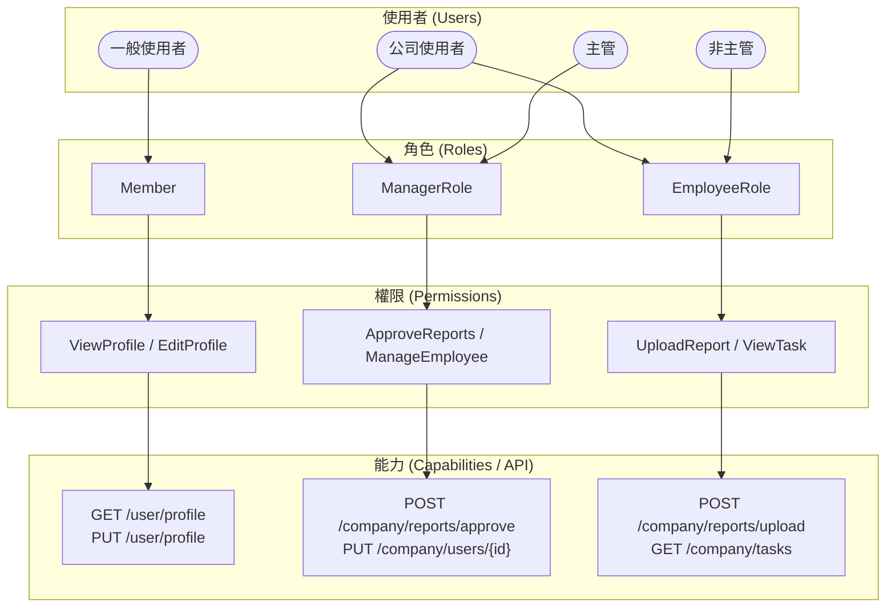

  

[🧭專案導覽](../README.md#專案導覽)

# 第一章《角色權限系統》 (Role & Permission System)

## 📖 概要

說明本系統中的角色與權限設計原則、授權邏輯以及資料表結構。  
角色權限系統是整個 CarbonProject 的核心基礎之一，確保不同使用者依據身份存取相應功能與頁面，並提升系統的安全性與可維護性。把 RBAC（Role-Based Access Control） 擴充到「多層使用者類別」與「企業層級分權」的架構

---

## 🎯 設計目標

- **確保安全性**：限制未授權使用者的功能操作與資料存取。  
- **提升擴充性**：新增角色或權限時不需大幅修改原有程式碼。  
- **支援多層級角色**：區分「平台管理者」、「企業管理者」、「一般會員」等不同層級。  
- **集中管理**：透過資料庫與後台介面集中管理角色與權限關係。  

### 🔹 兩大類使用者

#### 一般使用者（Individual User）

- 例：註冊會員、平台個人使用者
- 權限範圍：僅限個人帳戶、查看個人資料、基本操作
- 常見角色：Member, Guest

#### 公司使用者（Company User）

- 例：企業帳號、公司登入者
- 權限根據職位細分：
  * **主管**（**Manager / Admin**）可審核、管理員工、設定公司目標
  * **非主管**（**Employee / Staff**）只能上傳、查看自己負責的資料

---

## 🧩 系統架構概念

角色權限系統採用 **Role-Based Access Control (RBAC)** 模型實作，  
結構如下圖所示：

