  

[🧭專案導覽](../README.md#專案導覽)

# 第一章《角色權限系統》 (Role & Permission System)

## 📖 概要

說明本系統中的角色與權限設計原則、授權邏輯以及資料表結構。  
角色權限系統是整個 CarbonProject 的核心基礎之一，確保不同使用者依據身份存取相應功能與頁面，並提升系統的安全性與可維護性。把 RBAC（Role-Based Access Control） 擴充到「多層使用者類別」與「企業層級分權」的架構

---

## 🎯 設計目標

- **確保安全性**：限制未授權使用者的功能操作與資料存取。  
- **提升擴充性**：新增角色或權限時不需大幅修改原有程式碼。  
- **支援多層級角色**：區分「平台管理者」、「企業管理者」、「一般會員」等不同層級。  
- **集中管理**：透過資料庫與後台介面集中管理角色與權限關係。  

### 🔹 兩大類使用者

#### 一般使用者（Individual User）

- 例：註冊會員、平台個人使用者
- 權限範圍：僅限個人帳戶、查看個人資料、基本操作
- 常見角色：Member, Guest

#### 公司使用者（Company User）

- 例：企業帳號、公司登入者
- 權限根據職位細分：
  * **主管**（**Manager / Admin**）可審核、管理員工、設定公司目標
  * **非主管**（**Employee / Staff**）只能上傳、查看自己負責的資料

---

## 🧩 系統架構概念

角色權限系統採用 **Role-Based Access Control (RBAC)** 模型實作，  
結構如下圖所示：

```mermaid
flowchart TB
  subgraph Users["使用者 (Users)"]
    GU([一般使用者])
    CU([公司使用者])
    M([主管])
    E([非主管])
  end

  subgraph Roles["角色 (Roles)"]
    R1[Member]
    R2[ManagerRole]
    R3[EmployeeRole]
  end

  subgraph Permissions["權限 (Permissions)"]
    P1["ViewProfile / EditProfile"]
    P2["ApproveReports / ManageEmployee"]
    P3["UploadReport / ViewTask"]
  end

  subgraph Capabilities["能力 (Capabilities / API)"]
    C1["GET /user/profile\nPUT /user/profile"]
    C2["POST /company/reports/approve\nPUT /company/users/{id}"]
    C3["POST /company/reports/upload\nGET /company/tasks"]
  end

  GU --> R1
  CU --> R2
  CU --> R3
  M --> R2
  E --> R3

  R1 --> P1
  R2 --> P2
  R3 --> P3

  P1 --> C1
  P2 --> C2
  P3 --> C3
```

---

## 🧱 RBAC 四層關係：User → Role → Permission → Capability
| 層級 | 名稱 | 說明 |
|:-----|:-----|:-----|
| 👤 User（使用者） | 系統中的實際帳號 | Alice、Bob、管理員帳號 |
| 🎭 Role（角色） | 代表一組職責或身分，擁有一組權限 | Admin、Editor、Viewer |
| 🔐 Permission（權限） | 對系統資源的操作授權 | Article.Edit, User.Delete |
| ⚙️ Capability（能力 / 動作細項） | 具體可執行的功能或 API 操作	 | POST /articles/edit, DELETE /users/{id} |

### 範例
|	使用者	|	角色	|	權限	|	能力	|
| ----- | ------ | ----------- | ------------------- |
| Alice | Admin  | ManageUsers | DELETE /users/{id}  |
| Bob   | Editor | EditArticle | POST /articles/edit |
| Carol | Viewer | ViewArticle | GET /articles/{id}  |

| 使用者類型 | 角色       | 權限 (Permission) | 能力 (Capability / API)         |
| ----- | -------- | --------------- | ----------------------------- |
| 一般使用者 | Member   | ViewProfile     | GET /user/profile             |
| 一般使用者 | Member   | EditProfile     | PUT /user/profile             |
| 公司主管  | Manager  | ApproveReports  | POST /company/reports/approve |
| 公司主管  | Manager  | ManageEmployee  | PUT /company/users/{id}       |
| 公司員工  | Employee | UploadReport    | POST /company/reports/upload  |
| 公司員工  | Employee | ViewTask        | GET /company/tasks            |

---

## 🧠 為什麼要多一層 Capability？

一般的 RBAC 模型會停在「Role → Permission」，但實際系統中：
- Permission 是抽象的（邏輯層）
- Capability 是具體的（技術層 / API 或程式層）

例如：
> 「文章編輯權限（Permission）」 
> 對應到實際程式的 POST /api/article/edit（Capability）

這樣能讓：
- 權限邏輯與程式端操作解耦
- 更容易對接 REST API、微服務、或行為審計系統
- 安全審查更細緻：哪個角色觸發了哪個 API

---

> 📎 延伸閱讀  
  [第二章《使用者認證與註冊系統》](../docs/02_UserAuthAndRegister.md)  
  [第四章《Claims-based 認證流程》](../docs/04_ClaimsBasedAuthenticationFlow.md)  

---

[🌾頁首](#HEAD)