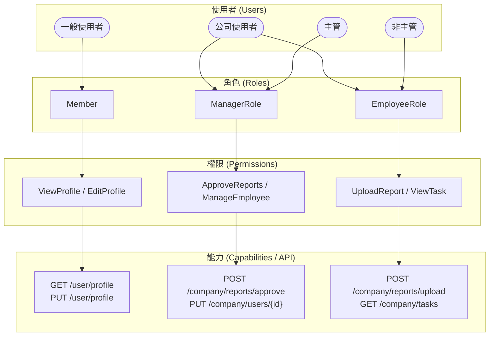

<a name="HEAD"></a>
<p align="center">
  
</p>

[🧭專案導覽](../README.md#專案導覽)

# 第二章《使用者認證與註冊系統》(User Authentication & Registration System)

## 📖 概要

介紹系統中使用者登入、註冊與身份驗證的完整流程，  
包含 **帳號建立**、**身分驗證** (**Authentication**)、**狀態維持** (**Session / Claims**)，  
以及如何與後續章節的 **Claims-based 認證機制** 進行串接。

---

## 🎯 設計目標

- **安全登入機制**：採用 ASP.NET Core Identity 驗證架構與加密密碼存放。  
- **資料一致性**：註冊後自動建立使用者的預設角色與公司關聯。  
- **良好使用者體驗**：登入後根據角色導向不同儀表板頁面。  
- **可追蹤行為紀錄**：整合 ActivityLog，記錄登入/登出時間與 IP。   

---

## 🧩 系統整體架構概念

```plaintext
使用者 (User)
   │
   ▼
瀏覽器 (Browser)
   │
   ▼
AccountController
   │
   ├── Register() → 建立帳號與角色關聯
   ├── Login() → 驗證身分、建立 Claims
   ├── Logout() → 清除 Session / Claims
   │
   ▼
Middleware (驗證管線)
   │
   ▼
授權控制 (Authorize)
```

---

## 🧠 使用者登入流程說明

1. **使用者輸入帳號密碼**
  前端送出 POST /Account/Login 請求至伺服器。

2. **伺服器驗證帳號與密碼**
  系統利用 Members 資料表比對帳號密碼（密碼以 SHA256 或 Identity 加密）。

3. **建立 ClaimsIdentity**
  登入成功後，系統會建立一組 Claims（包含使用者 ID、角色、公司 ID）。

4. **設定 Session 狀態**
  Session 儲存登入使用者基本資訊，供系統後續操作使用。

5. **導向對應頁面**
  - 管理者 → 後台控制台 (Admin Dashboard)
  - 一般會員 → 個人資料頁面 (Profile)


#### 一般使用者（Individual User）

- 例：註冊會員、平台個人使用者
- 權限範圍：僅限個人帳戶、查看個人資料、基本操作
- 常見角色：Member, Guest

#### 公司使用者（Company User）

- 例：企業帳號、公司登入者
- 權限根據職位細分：
  * **主管**（**Manager / Admin**）可審核、管理員工、設定公司目標
  * **非主管**（**Employee / Staff**）只能上傳、查看自己負責的資料

---

## 🧩 系統架構概念

角色權限系統採用 **Role-Based Access Control (RBAC)** 模型實作，  
結構如下圖所示：



---

## 🧱 RBAC 四層關係：User → Role → Permission → Capability
| 層級 | 名稱 | 說明 |
|:-----|:-----|:-----|
| 👤 User（使用者） | 系統中的實際帳號 | Alice、Bob、管理員帳號 |
| 🎭 Role（角色） | 代表一組職責或身分，擁有一組權限 | Admin、Editor、Viewer |
| 🔐 Permission（權限） | 對系統資源的操作授權 | Article.Edit, User.Delete |
| ⚙️ Capability（能力 / 動作細項） | 具體可執行的功能或 API 操作	 | POST /articles/edit, DELETE /users/{id} |

### 範例
|	使用者	|	角色	|	權限	|	能力	|
| ----- | ------ | ----------- | ------------------- |
| Alice | Admin  | ManageUsers | DELETE /users/{id}  |
| Bob   | Editor | EditArticle | POST /articles/edit |
| Carol | Viewer | ViewArticle | GET /articles/{id}  |

| 使用者類型 | 角色       | 權限 (Permission) | 能力 (Capability / API)         |
| ----- | -------- | --------------- | ----------------------------- |
| 一般使用者 | Member   | ViewProfile     | GET /user/profile             |
| 一般使用者 | Member   | EditProfile     | PUT /user/profile             |
| 公司主管  | Manager  | ApproveReports  | POST /company/reports/approve |
| 公司主管  | Manager  | ManageEmployee  | PUT /company/users/{id}       |
| 公司員工  | Employee | UploadReport    | POST /company/reports/upload  |
| 公司員工  | Employee | ViewTask        | GET /company/tasks            |

---

## 🧠 為什麼要多一層 Capability？

一般的 RBAC 模型會停在「Role → Permission」，但實際系統中：
- Permission 是抽象的（邏輯層）
- Capability 是具體的（技術層 / API 或程式層）

例如：
> 「文章編輯權限（Permission）」  
> 對應到實際程式的 POST /api/article/edit（Capability）

這樣能讓：
- 權限邏輯與程式端操作解耦
- 更容易對接 REST API、微服務、或行為審計系統
- 安全審查更細緻：哪個角色觸發了哪個 API

---

[🌾頁首](#HEAD)