<a name="HEAD"></a>
<p align="center">
  
</p>

[🧭專案導覽](../README.md#專案導覽)

# 第二章《使用者認證與註冊系統》(User Authentication & Registration System)

## 📖 概要

介紹系統中使用者登入、註冊與身份驗證的完整流程，  
包含 **帳號建立**、**身分驗證** (**Authentication**)、**狀態維持** (**Session / Claims**)，  
以及如何與後續章節的 **Claims-based 認證機制** 進行串接。

---

## 🎯 設計目標

- **安全登入機制**：採用 ASP.NET Core Identity 驗證架構與加密密碼存放。  
- **資料一致性**：註冊後自動建立使用者的預設角色與公司關聯。  
- **良好使用者體驗**：登入後根據角色導向不同儀表板頁面。  
- **可追蹤行為紀錄**：整合 ActivityLog，記錄登入/登出時間與 IP。   

---

## 🧩 系統整體架構概念

```plaintext
使用者 (User)
   │
   ▼
瀏覽器 (Browser)
   │
   ▼
AccountController
   │
   ├── Register() → 建立帳號與角色關聯
   ├── Login() → 驗證身分、建立 Claims
   ├── Logout() → 清除 Session / Claims
   │
   ▼
Middleware (驗證管線)
   │
   ▼
授權控制 (Authorize)
```

---

## 🧠 使用者登入流程說明

1. **使用者輸入帳號密碼**  
  前端送出 POST /Account/Login 請求至伺服器。  
2. **伺服器驗證帳號與密碼**  
  系統利用 Members 資料表比對帳號密碼（密碼以 SHA256 或 Identity 加密）。  
3. **建立 ClaimsIdentity**  
  登入成功後，系統會建立一組 Claims（包含使用者 ID、角色、公司 ID）。  
4. **設定 Session 狀態**  
  Session 儲存登入使用者基本資訊，供系統後續操作使用。  
5. **導向對應頁面**  
  - 管理者 → 後台控制台 (Admin Dashboard)
  - 一般會員 → 個人資料頁面 (Profile)

---

## 🔐 註冊流程說明

1. 填寫註冊表單
使用者輸入帳號、密碼、公司代碼與基本資訊。  
2. 驗證唯一性
系統檢查該 Email 是否已存在於 Members 資料表。  
3. 建立使用者帳號
  - 將密碼加密後儲存至資料庫。
  - 預設指派角色：User。  
4. 關聯公司資料  
  若提供公司代碼，會於 Members 表中建立 CompanyId 關聯。
5. 建立初始 ActivityLog  
  系統紀錄使用者註冊時間與 IP 位址。

---

## ⚙️ 範例程式碼片段

### 登入驗證邏輯

```C#
[HttpPost]
public IActionResult Login(string email, string password)
{
    var member = _context.Members.FirstOrDefault(m => m.Email == email);
    if (member == null || !VerifyPassword(password, member.PasswordHash))
    {
        ModelState.AddModelError("", "帳號或密碼錯誤");
        return View();
    }

    var claims = new List<Claim>
    {
        new Claim(ClaimTypes.Name, member.Name),
        new Claim(ClaimTypes.Email, member.Email),
        new Claim(ClaimTypes.Role, member.Role),
        new Claim("MemberId", member.MemberId.ToString()),
        new Claim("CompanyId", member.CompanyId.ToString())
    };

    var identity = new ClaimsIdentity(claims, "Login");
    var principal = new ClaimsPrincipal(identity);
    HttpContext.SignInAsync(principal);

    _activityLog.LogLogin(member.MemberId, Request.HttpContext.Connection.RemoteIpAddress?.ToString());
    return RedirectToAction("Index", "Home");
}
```

### 註冊邏輯

```C#
[HttpPost]
public IActionResult Register(RegisterViewModel model)
{
    if (ModelState.IsValid)
    {
        var member = new Member
        {
            Name = model.Name,
            Email = model.Email,
            PasswordHash = HashPassword(model.Password),
            Role = "User",
            CompanyId = model.CompanyId
        };

        _context.Members.Add(member);
        _context.SaveChanges();
        _activityLog.LogRegister(member.MemberId);
        return RedirectToAction("Login");
    }
    return View(model);
}

```
---

## 📊 資料表結構摘要

| 資料表             | 欄位                                                               | 說明             |
| --------------- | ---------------------------------------------------------------- | -------------- |
| **Members**     | `MemberId`, `Name`, `Email`, `PasswordHash`, `Role`, `CompanyId` | 儲存使用者基本資料與角色資訊 |
| **Companies**   | `CompanyId`, `CompanyName`, `IndustryType`                       | 儲存企業資訊         |
| **ActivityLog** | `LogId`, `MemberId`, `Action`, `TimeStamp`, `IPAddress`          | 記錄登入、登出、註冊等活動  |

---

## 🧭 認證流程圖

```mermaid
---
config:
  theme: redux-dark
---
flowchart TD
    A[使用者提交登入表單] --> B[伺服器驗證帳號密碼]
    B -->|成功| C[建立 ClaimsIdentity]
    B -->|失敗| G[顯示錯誤訊息]
    C --> D[建立 Session 狀態]
    D --> E[ActivityLog 紀錄登入事件]
    E --> F[導向 Dashboard 或 Profile 頁面]
```


---

## 🔗 與 Claims-based 認證關聯

本章為 **Claims-based 認證流程** 的前置階段，
使用者登入後產生的 Claims 將在後續授權與角色控制（第四章）中使用，
實現 「一次登入，全系統識別」 的安全架構。

---

## 🔍 小結

- 登入與註冊系統為整體安全架構的起點。
- 透過 Claims 儲存使用者狀態，可搭配中介層授權檢查。
- 與 角色權限系統、Claims-based 認證流程 深度整合，   
  提升系統安全性與維護性。

---

> 📎 延伸閱讀  
  [第一章《角色權限系統》](../docs/01_RolePermissionSystem.md)  
  [第四章《Claims-based 認證流程》(Claims-based Authentication Flow)](../docs/04_ClaimsBasedAuthenticationFlow.md)  

---

[🌾頁首](#HEAD)