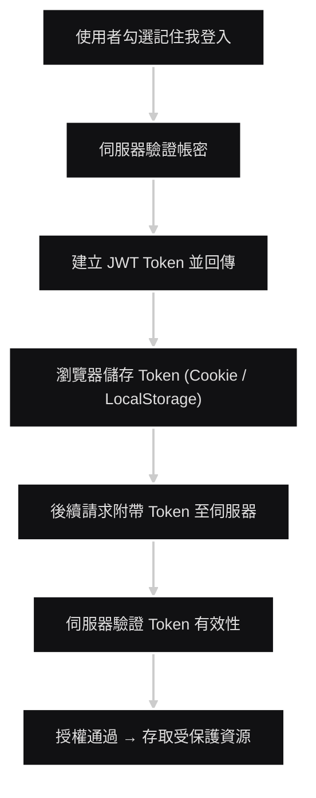

<a name="HEAD"></a>
<p align="center">
  
</p>

[🧭專案導覽](../README.md#專案導覽)

# 第三章《JWT 記住我功能》 (JWT & Remember Me Mechanism)

## 📖 概要

說明本系統中「**記住我**(**Remember Me**)」功能的實作，  
利用 **JWT**(**JSON Web Token**) 進行安全的長期登入管理。  
相較於傳統 Session，JWT 能支援 **跨裝置、跨伺服器環境** 的身份驗證，  
確保使用者在一定期間內保持登入狀態，同時維持高安全性。

---

## 🎯 設計目標

- **支援「記住我」持久登入機制**：使用者可選擇在下次開啟網站時自動登入。  
- **減少 Session 依賴**：JWT 存於 Cookie 或 LocalStorage，降低伺服器負載。  
- **強化安全性**：Token 簽章驗證避免竄改，並設定有效期限與刷新策略。  
- **無縫整合 Claims-based 認證**：登入時產生相同 Claims 結構，保持授權一致性。

---
## 🧩 系統運作流程概念
```plaintext
使用者登入 → 建立 JWT → 儲存 Token → 後續請求附帶 Token → 驗證 Token 有效性
```

---
## 🔐 「記住我」登入流程說明
1. **使用者登入並勾選「記住我」選項**  
  前端將選項值一併送至 /Account/Login。  
2. **伺服器驗證帳密後產生 JWT Token**  
  Token 內含使用者基本資訊與 Claims（例如 MemberId、Role）。  
3. 設定 Token 有效時間  
- 一般登入：Session 期限結束即失效
- 記住我登入：Token 有效期延長（如 7~30 天）
4. 回傳 Token 給前端  
- 若使用 Cookie：HttpOnly + Secure 屬性防止 XSS
- 若使用 LocalStorage：需搭配 CSRF 防護  
5. 後續請求自動攜帶 Token  
  前端於每次 API 呼叫時，於 Header 加入：

```C#
Authorization: Bearer <JWT>
```

6. 伺服器驗證 Token 有效性  
  若 Token 未過期且簽章正確，允許通過 Middleware 進入 Controller。

---
## ⚙️ JWT 結構示意
```json
{
  "header": {
    "alg": "HS256",
    "typ": "JWT"
  },
  "payload": {
    "sub": "MemberId",
    "email": "user@example.com",
    "role": "User",
    "exp": 1735689600
  },
  "signature": "HMACSHA256(base64UrlEncode(header) + '.' + base64UrlEncode(payload))"
}
```
---

## 💻 程式碼範例

### 產生 JWT Token
```csharp
private string GenerateJwtToken(Member member, bool rememberMe)
{
    var claims = new[]
    {
        new Claim(JwtRegisteredClaimNames.Sub, member.MemberId.ToString()),
        new Claim(ClaimTypes.Email, member.Email),
        new Claim(ClaimTypes.Role, member.Role),
        new Claim("CompanyId", member.CompanyId.ToString())
    };

    var key = new SymmetricSecurityKey(Encoding.UTF8.GetBytes(_jwtSettings.SecretKey));
    var creds = new SigningCredentials(key, SecurityAlgorithms.HmacSha256);

    var expires = rememberMe 
        ? DateTime.UtcNow.AddDays(7)  // 記住我：延長有效期
        : DateTime.UtcNow.AddHours(2); // 一般登入

    var token = new JwtSecurityToken(
        issuer: _jwtSettings.Issuer,
        audience: _jwtSettings.Audience,
        claims: claims,
        expires: expires,
        signingCredentials: creds
    );

    return new JwtSecurityTokenHandler().WriteToken(token);
}
```

### 登入時回傳 Token

```csharp
[HttpPost]
public IActionResult Login(LoginViewModel model)
{
    var member = _context.Members.FirstOrDefault(x => x.Email == model.Email);
    if (member == null || !VerifyPassword(model.Password, member.PasswordHash))
    {
        ModelState.AddModelError("", "帳號或密碼錯誤");
        return View(model);
    }

    var token = GenerateJwtToken(member, model.RememberMe);
    Response.Cookies.Append("jwtToken", token, new CookieOptions
    {
        HttpOnly = true,
        Secure = true,
        Expires = model.RememberMe ? DateTimeOffset.UtcNow.AddDays(7) : DateTimeOffset.UtcNow.AddHours(2)
    });

    _activityLog.LogLogin(member.MemberId, Request.HttpContext.Connection.RemoteIpAddress?.ToString());
    return RedirectToAction("Index", "Home");
}
```

### Middleware 驗證 Token

```csharp
public async Task Invoke(HttpContext context)
{
    var token = context.Request.Cookies["jwtToken"];
    if (!string.IsNullOrEmpty(token))
    {
        try
        {
            var handler = new JwtSecurityTokenHandler();
            var jwt = handler.ValidateToken(token, _validationParameters, out _);

            context.User = new ClaimsPrincipal(jwt);
        }
        catch
        {
            // Token 驗證失敗，不設定 User
        }
    }
    await _next(context);
}
```
---

## 📊 Token 驗證流程圖


---

## 🔒 安全性設計

| 項目                       | 說明                           |
| ------------------------ | ---------------------------- |
| **HttpOnly Cookie**      | 防止前端 JavaScript 讀取 Token     |
| **Secure 屬性**            | 僅允許 HTTPS 傳輸                 |
| **Token Expiration**     | 設定過期時間，避免永久登入風險              |
| **簽章驗證**                 | 使用 HMAC-SHA256 確保 Token 不可竄改 |
| **刷新機制 (Refresh Token)** | 過期前可自動更新 Token，有效提升使用者體驗     |

---

## 🔗 與其他章節關聯
- 本章的 JWT Token 為 **Claims-based** 認證 (第四章) 提供基礎憑證來源。
- 與 **登入系統**(**第二章**) 結合，形成完整的「登入 → 驗證 → 授權」流程。
- 可搭配 **ActivityLog** 紀錄 Token 登入行為。

---

## 🔍 小結
- JWT 是現代化、輕量級的身份驗證解法，適合分散式架構。
- 「記住我」功能透過延長 Token 期限達成持久登入。
- 適當搭配 Claims-based 授權，可兼顧使用者體驗與安全性。

---

> 📎 延伸閱讀  
  [第二章《使用者認證與註冊系統》](../docs/02_UserAuthAndRegister.md)  
  [第四章《Claims-based 認證流程》](../docs/04_ClaimsBasedAuthenticationFlow.md)  

---

[🌾頁首](#HEAD)