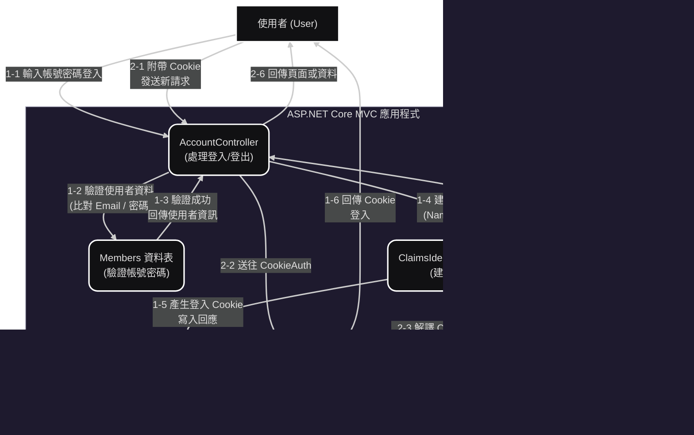

Claims-based 認證流程 (Claims-based Authentication Flow)

本系統採用 Claims-based Authentication（基於宣告的認證） 機制，
透過使用者登入後建立的 Claims（宣告）來進行身份驗證與授權控制。
此機制結合 ASP.NET Core MVC 的 Cookie 認證流程，確保登入狀態與授權檢查的安全性與彈性。

🔹 一、認證流程階段概述（7 個主要階段）
階段編號	階段名稱	說明
1	使用者登入請求	使用者透過瀏覽器輸入帳號與密碼，提交至伺服器端 AccountController。
2	驗證使用者憑證	Controller 呼叫 Service/Repository，從 Members 資料表驗證帳號密碼是否正確。
3	建立 ClaimsPrincipal	驗證成功後，系統建立 ClaimsIdentity，包含使用者屬性（如姓名、Email、角色等），並包裝成 ClaimsPrincipal。
4	簽發 Cookie	系統使用 HttpContext.SignInAsync() 將 Claims 打包成 Ticket，加密後存入瀏覽器 Cookie。
5	帶 Cookie 發送請求	使用者在後續請求中自動攜帶此 Cookie，伺服器據此識別使用者。
6	還原 ClaimsPrincipal	Cookie 驗證中介層（Middleware）會解析 Cookie，還原出使用者的 ClaimsPrincipal。
7	授權檢查與執行	[Authorize] 屬性與授權中介層會根據 Claims 驗證權限，若通過則執行對應 Controller Action。

🔹 二、認證與授權互動流程（PlantUML 詳細圖）

🔹 三、機制特點與優勢

基於屬性而非角色的授權控制：可根據不同的 Claims（例如部門、職稱、權限層級）進行細粒度控制。

安全性提升：Cookie 內容經過 ASP.NET Data Protection 加密簽章，避免偽造。

擴展性高：支援與外部身分提供者（如 Azure AD、Google、OAuth 2.0）整合。

授權統一：可用 [Authorize] 或自訂 Policy（如 RequireClaim("Role", "Admin")）統一控制存取權限。