  

[🧭專案導覽](../README.md#專案導覽)

# 第四章《Claims-based 認證流程》 (Claims-based Authentication Flow)

本系統採用 **Claims-based Authentication**（**基於宣告的認證**）機制，
透過使用者登入後建立的 **Claims**（**宣告**）來進行身份驗證與授權控制。
此機制結合 **ASP.NET Core MVC** 的 **Cookie** 認證流程，確保登入狀態與授權檢查的安全性與彈性。
Claims 是使用者身份的描述集合（如姓名、角色、公司 ID 等），
系統透過建立 ClaimsIdentity 來實現登入狀態與授權控制。

此章承接前一章 JWT 登入機制，詳細說明如何於登入後建立並使用 ClaimsIdentity，
以達到更彈性的角色與權限驗證。

## 🔹 一、認證流程階段概述（7 個主要階段）

| 階段編號 | 階段名稱 | 說明 |
|:----:|:----|:------|
| 1 | 使用者登入請求 | 使用者透過瀏覽器輸入帳號與密碼，提交至伺服器端 AccountController。 |
| 2 | 驗證使用者憑證 | Controller 呼叫 Service/Repository，從 Members 資料表驗證帳號密碼是否正確。 |
| 3 | 建立 ClaimsPrincipal | 驗證成功後，系統建立 ClaimsIdentity，包含使用者屬性（如姓名、Email、角色等），並包裝成 ClaimsPrincipal。 |
| 4 | 簽發 Cookie | 系統使用 HttpContext.SignInAsync() 將 Claims 打包成 Ticket，加密後存入瀏覽器 Cookie。 |
| 5 | 帶 Cookie 發送請求 | 使用者在後續請求中自動攜帶此 Cookie，伺服器據此識別使用者。 |
| 6 | 還原 ClaimsPrincipal | Cookie 驗證中介層（Middleware）會解析 Cookie，還原出使用者的 ClaimsPrincipal。 |
| 7 | 授權檢查與執行 | [Authorize] 屬性與授權中介層會根據 Claims 驗證權限，若通過則執行對應 Controller Action。 |

## 🔹 二、認證與授權互動流程（PlantUML 詳細圖）

```mermaid
---
config:
  theme: redux-dark
---
flowchart TB
    U["使用者 (User)"]:::actor
    subgraph ASP["ASP.NET Core MVC 應用程式"]
    direction TB
        Members("Members 資料表
        (驗證帳號密碼)"):::component

        Controller("AccountController
        (處理登入/登出)"):::component

        Claims("ClaimsIdentity / ClaimsPrincipal
        (建立使用者身份)"):::component
        %% 水平排列 CookieAuth
        subgraph CookieRow [" "]
            direction LR
          Authorize("授權屬性 [Authorize]
          (依 Claims 驗證權限)"):::component

          CookieAuth("Cookie Authentication
          (簽發登入 Cookie)"):::component
        end
    end
    class ASP node

%% 第一階段：登入流程
    
    U UC1@=="1-1 輸入帳號密碼登入"==> Controller
    
    Controller CM1@==>|"1-2 驗證使用者資料
    (比對 Email / 密碼)"| Members
    
    Members MC1@==>|"1-3 驗證成功
    回傳使用者資訊"| Controller

    Controller CC1@==>|"1-4 建立 ClaimsIdentity
    (Name, Role, Email)"| Claims
    
    Claims CCO1@==>|"1-5 產生登入 Cookie
    寫入回應"| CookieAuth
    
    CookieAuth COU1@=="1-6 回傳 Cookie
    登入"=====> U

%% 第二階段：後續請求與授權驗證

    U UC2@--"2-1 附帶 Cookie
    發送新請求"--> Controller

    Controller CCO2@-->|"2-2 送往
    CookieAuth"| CookieAuth
    
    CookieAuth COC2@-->|"2-3 解譯 Cookie
    還原使用者 Claims"| Claims

    Claims CA2@-->|"2-4 驗證授權屬性
    (Authorize)"| Authorize

    Authorize AC2@-->|"2-5 若符合 Claims
    執行 Action"| Controller

    Controller CU2@-->|"2-6 回傳頁面或資料"| U

linkStyle 0,1,2,3,4,5 stroke:#C8E6C9
linkStyle 6,7,8,9 stroke:#2962FF
linkStyle 8,10,11 stroke:RED
UC1@{ animate: true, curve: linear }
CM1@{ animate: true, curve: linear }
MC1@{ animate: true, curve: linear }
CC1@{ animate: true, curve: linear }
CCO1@{ animate: true, curve: natural }
COU1@{ animate: true, curve: linear }
UC2@{ curve: linear }
CCO2@{ curve: natural }
COC2@{ curve: linear }
CA2@{ curve: linear }
AC2@{ curve: linear }
CU2@{ curve: linear }
```

## 🔹 三、機制特點與優勢

- **基於屬性而非角色的授權控制**：可根據不同的 Claims（例如部門、職稱、權限層級）進行細粒度控制。
- **安全性提升**：Cookie 內容經過 ASP.NET Data Protection 加密簽章，避免偽造。
- **擴展性高**：支援與外部身分提供者（如 Azure AD、Google、OAuth 2.0）整合。
- **授權統一**：可用 [Authorize] 或自訂 Policy（如 RequireClaim("Role", "Admin")）統一控制存取權限。

---

[🌾頁首](#HEAD)